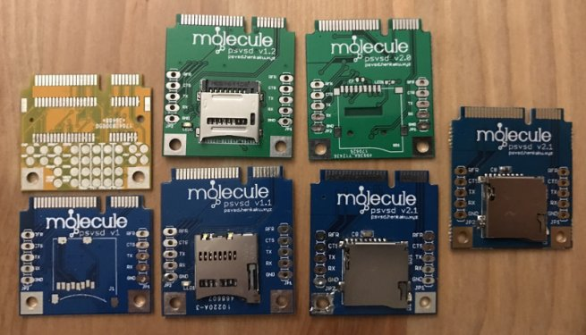
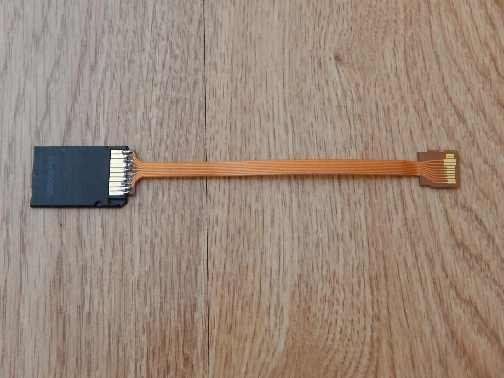

# SD2VITA history

Back then, we had two solutions. Either you buy a PSVita 3G and swap the 3G modem with a PSVSD to use a MicroSD, or else you destroy your wallet on amazon to order a memory card. We kinda lost hope, or not. We begged yfanlu to find a solution, but it was xyz who managed to find a way to use a MicroSD on any PSVita, without opening the vita nor any modification of this kind.\
\
And thus the SD2Vita was born.

## A little bit of history

Before creating the SD2Vita there were two previous attempts. One was created for the PSVita 3G model which replaced the 3G modem with a MicroSD adapter. This was made possible because the 3G modem was just a USB device.

The second attempt, not that much known is the richdapter. The idea was simple, replicate the idea of the MicroSD adapter for PSP Go.

With that in mind, let's try to create a MicroSD to PSVita memory card adapter !

So RichDevX made multiple attempts in order to create that adapter

 (1).png>)

.png>)

.png>)

But then why is it not on sale? Why did nobody hear about that adapter? Well because firstly it was mainly an overpriced adapter, lot of talking and little real progress made although he posted a video with his adapter in action which the PSVita is supposed to "recognize" by prompting to format the memory card. (In reality that just proves nothing, the PSVita cannot read the MicroSD so it asks to format). Lastly, the most important point was that the memory card authentification protocol was not totally reversed. So at the time, there was no way we could create a fake Sony memory card nor even some kind of Sony memory card reader. The project just died on its own and we never got any update about it.

.png>)

But there were other attempts made by RichDevX like plugging a USB stick into the mysterious 1000 port. A project that will be finalized by the CBPS team with a real POC but only much later.

.png>)

## The prototype

Using the cartridge slot wasn't the first attempt, we had before the Black Fin Cobra dongle which used the cartridge slot to communicate with the pc to share games on a placeholder.

 (1).png>)

.png>)

But using the cartridge slot as a memory card slot was made possible thanks to xyz. Devkit and Prototype vita could use a regular SD card, so there was a driver for that for the vita. The idea was to hook that driver to the cartridge slot, and create an adapter that connects the MicroSD pin to the cartridge slot pin. Since a PSVita cartridge was just an SD card with authentification.\
\
And thus was born the prototype, with the effort of xyz and motoharu who worked on reversing anything that has to do with memory card protocol, they made the first SD2Vita.


Omg yfanlu finger nudes leak


But as you can see, it wasn't as simple as installing a plugin, the process of loading the SD2Vita was not yet complete. And they had no plan on producing these like before where yfanlu sold the psvsd.

## The first version

The work was done, gamesd.skprx was released and the race had begun ! Xyz published the blueprint of the SD2Vita so anyone with PCB, soldering tools could create their own SD2Vita ! The first one to propose his adapter was moredrugsmore3somes_,_ followed by srident_._ The commercial SD2Vita name wasn't actually coming from XYZ, but by moredrugsmore3somes and srident who came up with the name when they tried to sell their version. Internally the name was just Gamecard adapter or GC EMU.&#x20;

But before the SD2Vita was actually on the market it had undergone some changes.&#x20;

The order was as follows : Xyz -> Second engineer -> Gadorach -> First SD2Vita sold.\
\
The Xyz blueprint was made so that the sd2vita was as cheap as possible to build. But there were some imperfections

> XYZ wasn't familiar with good design practices at the time, and just kinda threw it together as a fun thing. He excluded a few pads that he found inconvenient to solder in the SD slot, and he didn't add any thermal relief either for many of the ground plane pads, making them difficult to solder to. His physical pad layout was also a bit off, which I discovered when I reverse engineered the Vita gamecard to verify everything mechanically. It wasn't off so much as to cause issues, it was more just perfectionism on my part.\
> \
> Gadorach

Seeing this some people wanted to improve the SD2Vita blueprint and an unknown engineer released the first update to the SD2Vita.

> The second engineer after XYZ actually did a pretty good job as well. He fixed a few things, and even went so far as to implement matched trace lengths in his design. SD cards aren't high enough frequency for this to matter, but it was a good idea from an engineering standpoint. His was good, but I can only assume that he was just bad at advertising himself, so no one paid attention to it really.\
> \
> Gadorach

&#x20;Lastly, the final update for the original SD2Vita was made by Gadorach. His version was used by others to commercially sell the SD2Vita. It was the standard SD2Vita blueprint and it was cheap to produce so many people from the scene wanted to do their own so we had different variants of the SD2Vita.

> Other than what I discussed, my initial design implemented a bit better layout. I added the little holes at the top of the board, which have the dual purpose of stitching the ground planes and also making it a lot easier to pull the board out with either a dental pick or a small piece of pre-installed thread. It took better advantage of the available space on the board and reconnected the cartridge detect pin to the SD detect mechanism on the SD card for easier SD swapping if desired. Above all, I was much better at advertising, and as PCBWay had just opened a year prior and didn't have that much traction yet, when I found it, they had just, days before I went to do it, implemented their new system for sharing community board designs. I believe I was in the first 3 posts on that board actually. The main reason my variation took off wasn't that I had an overly superior design, though it did feature several improvements. The real reason is that I put in the work to make it as easy as possible for anyone else, without an engineering background, to have the boards manufactured by PCBWay and make them up. I'm actually pretty sure that helped influence the maker community into finding out about PCBWay as well. Before, there were only a few YouTubers that mentioned them that I could see, but after, they really blew up with all the attention around it. Regardless, it was carried mostly by my effort in advertising and making things as easy as possible over my engineering skills. Given I was just out of school at the time, my engineering was still only so-so, and despite doing my best to correct things, I'm actually an electronics engineering technologist, not a formal electronics engineer, in case you get confused from several people mixing up the terms.\
> \
> Gadorach

.png>)

 (1).png>)

 (1) (1).png>)

.png>)

.png>)

The first SD2Vita version sold was only PCB, and it had a major advantage which is the MicroSD push-to-eject system which makes it easy to insert and remove the MicroSD.\
The same can't be said about removing the sd2vita from the vita, as you can see it's barebone, so there's no PCB that handles the eject mechanism of the cartridge slot. So you insert the sd2vita annnd, good luck removing it.&#x20;

Most people just left the sd2vita inside the vita, and thanks to the push mechanism of the SD2Vita they could easily access it even if the sd2vita was blocked inside the vita.&#x20;

Then again some people found some tricks, the first one was to grab one of the sides of the SD2Vita with that tool, and remove it like a horn on your toe.

.png>)

The problem is that removing the sd2vita with that was still tricky, while it worked, it could damage both the sd2vita PCB and the cartridge slot. Mine suffered enough with that one.

The second solution was to put some tape on the sd2vita that came off the cartridge slot so you can pull on the tape, which will bring the sd2vita outside the cartridge slot. So far that was the best solution.

Oh yeah and I forgot to mention something.

**It cost 15€**

I don't really know who decided to put that price, especially since buying a soldering kit + PCB wasn't that costly and the demand was high. But then again it's because the demand was high and it was a small price to pay for salvation compared to sony memory card prices.

The ones I showed you were the most popular and the most RELIABLE.

One problem with that kind of SD2Vita is that if the build quality was messed up it could turn off your PSVita if you plugged the SD2Vita in. Because it would create a short circuit.

\
\

.png>)

Some vendors did not apply any solder masks so the pins are out there breathing. And if you put the SD2Vita the wrong way, the pins get shorted and the PSVita will shutdown immediately. Which is why you had to be cautious about the way you insert the PSVita

## The second version

So as I said, removing the sd2vita would be tricky, so a V2 was made. It's the same as the V1 but with an extra PCB layer that would handle the push to eject mechanism of the PSVita.\

 (1).png>)

It was a nice idea, frankly. And it would have met its success if it wasn't for the poor quality of the whole thing. It keeps catching the springs when trying to pop out of the cartridge slot which damaged the slot, and they were less reliable meaning there was a higher chance of your vita being powered off after inserting that one. It was kind of a disaster and was shortly not recommended.

## The third version

With the V2 failure, people still tried to find a way to make a sd2vita that can use the push to eject mechanism. And Gadorach, who made one of the first versions of the SD2Vita, had an idea in mind. Let's forget about using PCB and replicate a real vita cartridge.

.png>).png>) (1).png>) (1).png>)

HackInformer decided to team up with Gadorach in order to create those sd2vita (alongside having the exclusivity of selling those.

So the SD2vita Plus project was born

.png>)

It was supposed to be a premium product and it was its main selling point when compared to the V2. But unfortunately, their money hunger was stronger than their abilities and the project was a failure. They put a launch date without even being sure that it would be successfully made, and they took pre order.

 (1).png>)

The main problem was the plastic which was not quite right, apparently their producer failed them and they had a lot of problems with.

.png>)

The failure of the project made Gadorach release the blueprint and China took a hold of them. If anyone can manufacture anything, it's them. No more competition like in the V1 era where anyone could produce those, the market changed. The producer was now China, and the V1 creators began to change into resellers, so anywhere you go, you buy an SD2vita from a reseller, but the product is the same.

> It's possible, but unlikely. I'm pretty sure the V3 was just reworked by the Chinese internally and pumped out. They likely for inspiration from my earlier posts showing one way it could be done, and then just had one of their engineers draw it up. It isn't complicated when you have all the information. I posted a complete measurement guide for the gamecard on my Twitter a while before I made the plus model, so there was plenty of available information for any interested parties.\
> \
> Gadorach about if the V3 used his blueprint

And thus officially, the V3 was born :&#x20;

.png>)

Wait, it's not red? Mine is red. Which version is it?

The white version had a problem (damn again) : the glue was melting and the SD2Vita was unusable.&#x20;

The red version which is labeled V3.5 (but often labeled V3 as it replaced all the white versions in the market) fix that issue. \
\
It also had a price drop, it wasn't 15€, but around 5-10€ at release. Thanks China !........ Or not, since it's China and it came from one producer and was mass produced, there were a lot of faulty ones produced and sold. And since there were no competitors, there was no alternative. So generally you had to buy another one if the one you got was not working.

## The V5

wait, I did maths at school, I know how to count.

1.....2.......3......4?

Where is the V4?

Well, technically the V4 is the V3.5 which is the black and red version. As to who decided how to label those SD2Vita I guess it's the Chinese manufacturer.

Anyway, why did we need a V5? To fix the rate of faulty SD2Vita sold? Nope !

The V3 couldn't really fit in a slim PSVita as it was too high, so the cartridge slot couldn't close on slim because the top of the SD2Vita would pop out. This redesign aims to fix that so it can easily fit on a slim PSVita.\
\

.png>)

Since october 2019 the white SD2Vita V5 got a little revision like the V3, so a V5.5 (and not V6 as it is often mislabelled by the others as there's no major revision). It didn't aim to fix a specific issue but instead improve the reliability of the adapter by using a different kind of plastic.

> Smooth plastic instead of rough surface
>
> Plastic is slightly bendable instead of rigid
>
> easier to remove microsd card
>
> No plastic between individual metal contacts, making it possible to clean any oxidation
>
> \
> u/yussoffb01

.png>)

## The V6

Wait what V6? I don't see it anywhere. And why V6?

Well the aim of the V6 was to do some kind of SD2Vita plus, a premium product. So yeah the inside was better made, and the quality of the end product did feel premium compared to the Chinese version, and it was also originally intended to have the push to eject MicroSD mechanism that was left behind starting V3, but the problem was the price. Why buy a SD2Vita V6 for 15-20€ when you can buy a V5 for 2-3€ ?

So it ended up being a total failure and not sold anymore (through amazon the original seller has no stocks left) unless you go to ebay or the chinese market. Which is a shame because the original idea was great.

 (1).png>)

.png>)

## Which version do I have?

The answer is very simple, check the color and you know the version............Or not.\
\
My guess is that there are 2 Chinese manufacturers, and one does the black sd2vita and the other one does the white one.&#x20;

There are different variations of the SD2vita V5 on the market :

 (1).png>).png>)

&#x20;wait compatible what?

All I can say is that we should avoid the SD2Vita which presentation miss the MicroSD or Compatible tag. Since those tend to have a higher faulty rate. Better find a good reseller who does his job correctly and doesn't just pick an image from google image to showcase his product. A V5.5 (or V6 as it is often labelled on the internet) is the best version today for a cheap SD2Vita.\
\
Also the funny thing is that the V3 was updated to be a V5.5. The shape looks exactly like the V5.5 but the color design is still the same as the V3. Not mentioning that you can find V3 with either bright red text, dark red or even silver text...\

.png>)

.png>)

So nowadays you can still find on the market the V3 or the V35 or the V5 or the V5.5, it's quite the mess to be honest and I think that it's because the black one and white one isn't produced by the same Chinese manufacturer. So one just updated his SD2Vita to fix the shape without really labelling it as V5. The only thing you can really trust to know the version of the adapter is the shape.\
\

