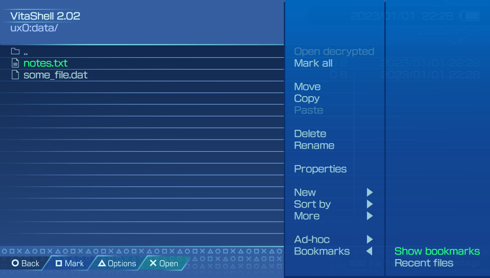

# Vitashell

Vitashell is a powerful tool, not only it's a file manager but it's also a multimedia tool that plays music and shows pictures, installs applications and shares the content of your memory with other devices. The problem is, you don't really know what to do with it right? Then fear not ! We will uncover each and every secret of this amazing tool !

## How to use Vitashell

### Main Menu

First let's start with the basics, the main menu of Vitashell

<figure><figcaption></figcaption></figure>

This is "home", here you have all the partitions the vita has. But what are they?\

* gro0: this partition is the gamecard, it contains the game data. Called GamcardReadOnly
* grw0: this partition is the writable area of the gamecard, generally used to save the savedata inside the gamecard. Stands for GamecardReadWrite
* imc0: is the internal memory of the PSTV and PSVita slim, when unused it is mounted to this partition.
* os0: is the partition that contains the OS kernel modules, very important (it is read-only)
* pd0: stands for pidata, it contains the welcome park app as well as the introductory video you see when you first setup a PSVita.
* sa0: is the partition that contains the dictionary and font file used by the vita
* tm0: is the partition related to activation, it contains the act.dat&#x20;
* ud0: is the partition used to temporarily hold the update file so that the firmware can be installed. When you update your vita, the pup file downloaded is moved there.
* ur0: is the internal memory of the PSVita, stands for UseR, and it contains the livearea cache and application database. Other stuff used by the system and also the hack like the tai folder which contains the plugins and hack related modules like henkaku and taihen are stored there.
* uma0: is the second memory of the PSVita, used as a general-purpose storage by the user himself. Homebrew can use it to load data from there such as roms. Often used in a setup that includes a SD2Vita + MemoryCard.
* &#x20;ux0: is the main memory of the PSVita, used to install applications, music, photos, and video. It is your MemoryCard or your SD2vita
* vd0: is the partition that contains the registry and the error history of the PSVita
* vs0: is the partition that contains the system application and libraries. Also, read-only

So that's it for the partition you can see, if you press triangle, you can have the little menu on the right you see in the screenshot. Let's describe the options :&#x20;

<figure><figcaption></figcaption></figure>

* Mount imc0: allows mounting the unused internal partition to access its content
* Mount uma0: used to mount any USB drive as uma0: directly from Vitashell.&#x20;
* Mount  xmc0: used to mount the memorycard if it's not mounted elsewhere and unused. Kind of like imc0 for the internal memory.
* Unmount uma0:, xmc0: imc0: you unmount the selected partition
* Mount USB/Gamecard as ux0: Allows to mount a USB drive or an SD2Vita as ux0 on the fly without a reboot. This will not refresh the Live Area so if the bubble of your application installed on the SD2Vita isn't available on the LiveArea before you mount the device, it will not appear like you would if you used a standard SD2Vita plugin and reboot.\
  **NOTE :** You must mount the USB as uma0: first before you can use this option ****&#x20;
* Refresh LiveArea : Wil scans the content of ux0:app and will add to the database a new application that is not present already in the app.db, the game needs to have a valid license to be recognized and added.
* Refresh license database: Will refresh the license database if you add a license file

### Inside a partition

Once you select a partition, you have access to the content of that partition, and you have new options

<figure><figcaption></figcaption></figure>

* Open decrypted : Games by default are encrypted with PFS, in order to access the decrypted content of said game, highlight the folder of the game that is PFS encrypted and select this option, it will open the game folder and every file will be decrypted, you can open them or copy them in a location. The decryption is not permanent once you leave this mode the content will be back to an encrypted state.
* Mark All: will highlight all the folders
* Move, Copy, Past, Delete : are self-explanatory
* Properties : If you want to have more information about a folder or a file such as its size or the number of files the folder has.
* New : allows you to create another file or another folder
* Sort By : Allows sorting the files and folder with the setting you want
* Ad-hoc : Open an Ad-Hoc connection so that you can share a file between two PSVita that use vitashell in Ad-Hoc mode

#### More options

<figure><figcaption></figcaption></figure>

* Compress : create a zip of your selected files/folder
* Install all : install selected vpk in a row
* Install folder : Old option that we used to install an application by highlighting the folder and using that option to install the app
* Export media : Used to add video/music to the database so that they would appear in the official music/video app
* Calculate SHA1 : Create a SHA1 hash which is used to verify the integrity of the file by comparing the SHA1 hash of the file you have with the original SHA1.

#### Bookmarks

Lastly, the Bookmarks option can be quite useful, you can either view a list of recent files you have opened with Vitashell, or bookmark your important files so that you don't have to navigate between all those directories again.

First highlight the file you want to bookmark, then select the New menu and use the New bookmark option

<figure><figcaption></figcaption></figure>

You can then use the show bookmark option to get access to this file directly

<figure><figcaption></figcaption></figure>

<figure><figcaption></figcaption></figure>

### Text editing

You can edit text files directly from Vitashell. Any files that aren't vpk, mp3, pictures, and compressed files will be opened by the text editor.&#x20;

<figure><figcaption>
let's open the most important text file of the PSVita
</figcaption></figure>

You can move between each line, and press x on the line you want to edit, it will bring the PSVita keyboard.&#x20;

If you open the menu, you see that you have some more options like marking the lines, cut copy and pasting a line or deleting it, inserting an empty line, and even searching for words inside a text file.&#x20;

You also have the ability to open the file with a hex editor instead

<figure><figcaption>
So many zeroes are we in matrix?
</figcaption></figure>

#### Main settings

<figure><figcaption></figcaption></figure>

When you press start, you have access to a mini menu where you can change the main settings.

You can change the theme of Vitashell if you feel full black is bad for your eyes, and you can change the USB device that will be mounted if you decide to use the USB connection mode. So you can access either the SD2vita, the PSVSD, the gamecard (which is different from the SD2Vita option, it is used if you want to mount the gamecard to dump its content) or the memorycard on your PC.

You can also swap between FTP mode or USB mode when you press the SELECT button.

Then you have some self-explanatory options.

## Transfering files from PSVita to PC/VITA

Thanks to Vitashell, you can access the content of your PSVita easily on your PC and transfer files between them.

### USB

First of all, you need to select USB mode in SELECT button option as mentioned just above. then press select (not when the main settings menu is open) to start a USB connection between your computer and your PSVita

<figure><figcaption></figcaption></figure>

Plug your PSVita to your PC with the USB cable and the connection will be initiated

<figure><figcaption></figcaption></figure>

Before enjoying your PSVita content on your PC, there is a setting you must change on your windows explorer (Mac and Linux too, just enable hidden folders/files)&#x20;

Open the View settings and make sure those  options (Hidden files and folder and Hide protected operating system files) are set like in the pictures below

<figure><figcaption></figcaption></figure>

And now you should find your PSVita mounted as a USB drive on your windows explorer !

### FTP

This method is wireless, and while it is convenient as it allows you to access all partitions (instead of just restricting you to a memory device like in USB mode) it is limited by the PSVita slow Wifi speed. So if you have big files to transfer avoid using this mode.

Make sure you select FTP as the SELECT button mode, then same as USB mode, press the SELECT button to open the FTP connection.

<figure><figcaption></figcaption></figure>

You can then use any FTP client you want from any device that supports it so like your PC, your phone or tablet and even another hacked console !

In this case we will still use Windows as an example.

Open the windows explorer, and write the ftp address in the navigation bar. Since windows explorer has a FTP mode built in, it can access the FTP server created by the PSVita

<figure><figcaption>
Write it here
</figcaption></figure>

<figure><figcaption>
Tadaaa, you have access to all the partitions of the PSVita
</figcaption></figure>

<figure><figcaption>
Accessing the memorycard content in ux0
</figcaption></figure>

### AD-Hoc

If your friend has a funny screenshot or music and he wants to send it to you without using a pc s an intermediate, then you can use AD-hoc mode to transfer files from one PSVita to another.

<figure><figcaption></figcaption></figure>

Select the file you want to send, then use the Send option. On the second PSVita, use the option Receive to start listening for any files incoming. Vitashell will initiate a connection between the two PSVita and send the file

## Issues with Vitashell
