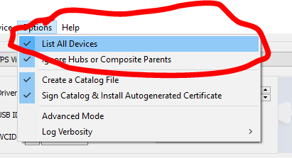

# QCMA

You struggle with QCMA? Can't manage to connect to your PC? You're most likely facing a driver issue. We usually need prefer connecting the Vita through Wi-Fi with QCMA to avoid problems since it's used mostly for transfering H-encore to the PSVita. But if you need to connect your PSVita through USB \(for FW reinstallation or to make a backup that would take ages to complete through Wi-Fi because the PSVita Wi-Fi chip is limited to 8mb/s\) then let's see how we can solve this.

Note : Everything here is designed for a Windows user. Mac users have already the best OS when it comes to program installation and doesn't have any problems. Linux users shouldn't face too many problems either.

## 1 - Make sure you don't have CMA installed

If you already installed it then it will conflict with QCMA, so you won't be able to successfully connect to the PC. Delete the drivers installed with the PSVita too.

## 2 - Delete the drivers manually and reinstall it.

For that we will do it in 2 step. The first one is to delete the driver of the PSVita using the device manager in Windows, then try to find the PSVita device. It should look like that :

Right click on it, go to propreties, then uninstall the device \(make sure you tick the delete the driver box\)

Second step is to download the software zadig \(no virus guarantee\) You can get it [there](https://zadig.akeo.ie/).

Once you have installed the app and run it, list all the devices and select the PSVita \(make sure the PSVita is connected ofc\).

As for the driver, we had better luck with libusbk so install it with zadig.

Press the install button and it should be good. Reboot your PC and connect the Vita and QCMA should connect fine to the Vita.

Note : On very rare occasions even after doing these steps. QCMA won't connect to the Vita. You can try to use the official CMA from Sony \(For cases like if you want to reinstall the firmware. It does the job\) Or take a virgin PC and install QCMA on it

